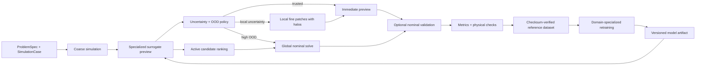

# ShardSim workflow

ShardSim separates model construction from runtime preview so that a nominal solve is not required before every useful prediction.

## End-to-end loop

## Bootstrap loop

1. Compile the requested physics into a typed `ProblemSpec`.
2. Generate a diverse initial design of experiments.
3. Run coarse and nominal solvers at the same physical horizon.
4. Store raw coarse, nominal, delta, error map, provenance, and metrics.
5. Train one surrogate for a compatible domain, equation, schema, and grid contract.
6. Publish the model only after numerical, physical, uncertainty, and OOD checks pass.

## Runtime loop

1. Validate the new `SimulationCase` against the model descriptor.
2. Run the coarse solver and generate a preview with uncertainty and OOD score.
3. Accept the preview, refine uncertain tiles locally, or request a global nominal solve.
4. Return the preview before optional nominal validation.
5. Compare preview, adaptive result, and nominal result using the same raw units.
6. Persist newly selected references and retrain the same specialized model.

## Scientific invariants

- Coarse and nominal simulations end at the same physical `t_end`.
- Diffusivity, geometry, boundaries, grid, units, and schema are explicit model inputs.
- `nominal = coarse_on_nominal + delta` remains true before any dataset-level transform.
- Normalization statistics are fitted on training data and stored with the model artifact.
- Validation cases are disjoint from training and model-selection cases.
- Local patches use halos and time-interpolated coarse interface conditions.
- Reported compute fractions use updated interior cell-steps and do not hide orchestration costs.
- OOD and uncertainty thresholds decide when the physical solver remains mandatory.

## Current implementation map

| Workflow responsibility | Implementation |
| --- | --- |
| Typed problem and result contracts | `src/shardsim/contracts.py` |
| Stable heat solver and temporal traces | `src/shardsim/solvers/heat.py` |
| Coarse/nominal reference generation | `src/shardsim/pipeline.py` |
| Specialized surrogate and artifact | `src/shardsim/surrogates/mean_delta.py` |
| Preview and nominal validation | `src/shardsim/preview.py` |
| Local tiled refinement | `src/shardsim/refinement.py` |
| Adaptive preview orchestration | `src/shardsim/adaptive.py` |
| Reference dataset manifest | `src/shardsim/dataset.py` |
| Active case selection and retraining | `src/shardsim/active_learning.py` |
| Unified eight-step workflow | `src/shardsim/workflow.py` |
| OpenFOAM nominal learning example | `examples/heat_openfoam_learning_workflow.py` |

## Solver separation

The coarse and nominal paths are independent dependencies. A fast internal solver can generate
the runtime preview input while a pinned OpenFOAM adapter generates the training and validation
reference. Field location is part of `SimulationResult`: internal structured heat fields are
point-based, whereas OpenFOAM finite-volume fields are cell-centred. Boundary-node residuals are
therefore never applied to cell-centred outputs.

`SimulationLearningWorkflow` exposes the complete repeatable cycle:

1. `analyze` extracts typed inputs, outputs, units, shapes, locations, and solver identities;
2. `bootstrap` runs coarse and nominal solvers, persists references, and trains the surrogate;
3. `preview` performs a coarse-only runtime prediction unless nominal validation is requested;
4. `evaluate` tests the model on disjoint cases and promotes it only if it beats the coarse field,
   stays below the configured error threshold, and has adequate uncertainty coverage;
5. `run_iteration` ranks new cases, solves selected nominal cases, compares predictions, persists
   the new references, retrains the domain/equation-specific model, and republishes its artifact.

`run_campaign` repeats selection, nominal enrichment, retraining, and holdout evaluation until the
quality gate passes, the candidate pool is exhausted, or the iteration budget is reached. Holdout
coarse and nominal results are cached by immutable case identity, so evaluating a new model does
not rerun the expensive nominal solver.

Every retraining invalidates the previous promotion. Until the new artifact passes `evaluate`,
`WorkflowPreviewResult.field` falls back to the coarse field resampled on the nominal grid.

## Promotion gates

A model should be promoted only when all configured gates pass:

- preview MAE, RMSE, relative L2, and maximum error;
- boundary residual and equation-specific physical residuals;
- uncertainty coverage at configured confidence levels;
- OOD rejection on intentionally invalid cases;
- speedup and cell-step reduction against the nominal baseline;
- stable performance across seeds and disjoint scenario families.

`MeanDeltaSurrogate` remains the explainable baseline. `HeatLocalResidualSurrogate` is the first
equation-specific model: it learns a shared local correction from temperature, gradients,
Laplacian, coordinates, boundary distance, diffusivity, time, and geometry. This translation-aware
model uses ridge regularization, persists its preprocessing state, and estimates uncertainty from
training residuals and delta variability.

`HeatDesignSpace` generates reproducible Latin Hypercube designs for diffusivity, time, source
position, source width, amplitude, and baseline. Training, model-selection, and evaluation designs
must use different seeds and case prefixes.
